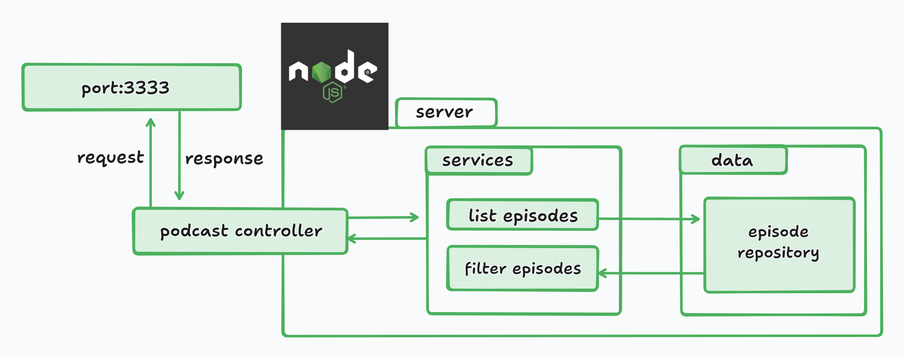

# Podcast manager

### Description

A Netflix-style app, where you can centralize different podcast episodes separated by category.

### Features

- List podcast episodes in category sections.
  - [health, fitness, mentality, humor]
- Filter episode from podcast name.

### Objectives

- List episodes in categories in a API Rest (json) with podecast name, episode name, cover image and link.
- Your json format have to be in this format:

```
  js
  [
    {
      podcastName: "flow",
      episode: "GUTO GALAMBA - Flow #366",
      videoId: "ymJ0K76DeU4",
      cover: "https://i.ytimg.com/vi/ymJ0K76DeU4/hqdefault.jpg",
      link: "https://www.youtube.com/watch?v=ymJ0K76DeU4&ab_channel=FlowPodcast",
      categories: ["saude", "fitness", "humor", "sport"]
    },
    {
      podcastName: "flow",
      episode: "RUBENS BARRICHELLO - Flow #339",
      videoId: "4KDGTdiOV4I",
      cover: "https://i.ytimg.com/vi/4KDGTdiOV4I/hqdefault.jpg",
      link: "https://www.youtube.com/watch?v=4KDGTdiOV4I&ab_channel=FlowPodcast",
      categories: ["sport", "race"]
    },
  ]
```

#### architeture draw


